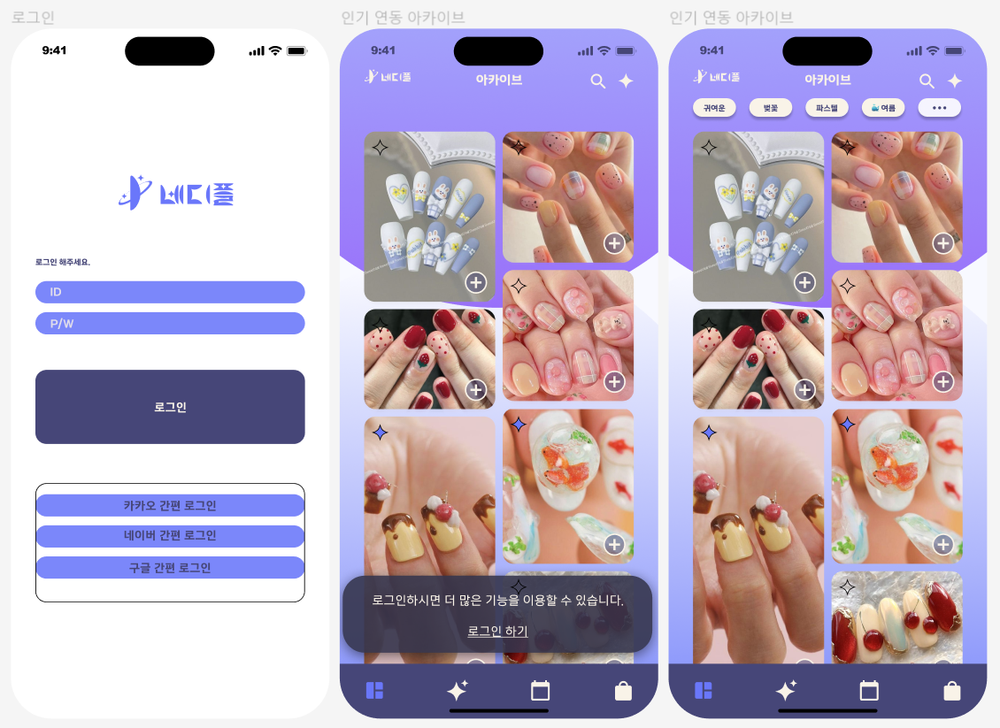
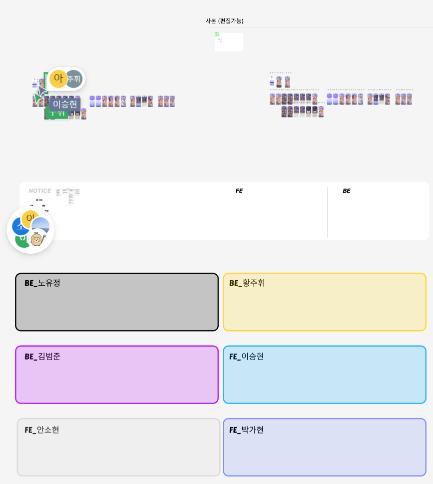
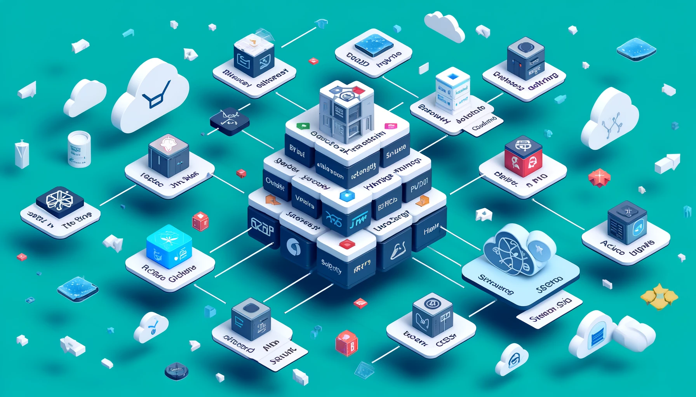

## $$\color{purple}\fbox{\Huge \color{pink}{네디플}}$$  



- 사용자에게 네일아트 이미지를 제공하는 서비스  


# [Figma 바로가기](https://www.figma.com/file/e3GJ5HK0GHf8ZT2DD2bknD/%EB%84%A4%EB%94%94%ED%94%8C_oz_6%ED%8C%80?type=design&node-id=0-1&mode=design&t=Ca7E8i2RbmgKXbin-0)



- OZ 2기 6조 합동프로젝트  

---

## 🧰 사용 스택


### :wrench: System Architecture



### FE
<div align=center>
   
   
   
  <br>

   
  
  
  
  <br>

  
  
  
  
  
  <br>
</div>

### BE
<div align=center> 
  
   
  
  <br>

  
  
   
  
  <br>

  
  
  
  <br>
</div>


--- 


## :busts_in_silhouette: 팀 동료

<div align="center">

### BD

| <a href="https://github.com/FE-02-SOMI"><br/><sub><b>@Lemaduho</b></sub></a><br/> |
| :----------------------------------------------------------------------------------------------------------------------------------------------------------: |
|                                                                            이소미                                                                            |

### FE

 <a href=https://github.com/lsh7465><br/><sub><b>@lsh7465</b></sub></a><br/> |
 :--------------------------------------------------------------------------------------------------------------------------------------------------------------: |
|                                                                              이승현                                                                              |

### BE

| <a href=https://github.com/joowhi><br/><sub><b>@joowhi</b></sub></a><br/> | <a href=https://github.com/bamjun><br/><sub><b>@bamjun</b></sub></a><br/> | <a href=https://github.com/YoojungRo><br/><sub><b>@YoojungRo</b></sub></a><br/> |
| :----------------------------------------------------------------------------------------------------------------------------------------------------------: | :--------------------------------------------------------------------------------------------------------------------------------------------------------------: | :-------------------------------------------------------------------------------------------------------------------------------------------------------: |
|                                                                           황주휘                                                                           |                                                                              김범준                                                                              |                                                                          노유정                                                                           |

</div>


## 📑 프로젝트 규칙

### Branch Strategy
> - main / dev 브랜치 기본 생성 
> - main과 dev로 직접 push 제한
> - PR 전 최소 1인 이상 승인 필수

### Git Convention
> 1. 적절한 커밋 접두사 작성
> 2. 커밋 메시지 내용 작성
> 3. 내용 뒤에 이슈 (#이슈 번호)와 같이 작성하여 이슈 연결

> | 접두사        | 설명                           |
> | ------------- | ------------------------------ |
> | Feat :     | 새로운 기능 구현               |
> | Add :      | 에셋 파일 추가                 |
> | Fix :      | 버그 수정                      |
> | Docs :     | 문서 추가 및 수정              |
> | Style :    | 스타일링 작업                  |
> | Refactor : | 코드 리팩토링 (동작 변경 없음) |
> | Test :     | 테스트                         |
> | Deploy :   | 배포                           |
> | Conf :     | 빌드, 환경 설정                |
> | Chore :    | 기타 작업                      |


### Pull Request
> ### Title
> * 제목은 '[Feat] 홈 페이지 구현'과 같이 작성합니다.

> ### PR Type
  > - [ ] FEAT: 새로운 기능 구현
  > - [ ] ADD : 에셋 파일 추가
  > - [ ] FIX: 버그 수정
  > - [ ] DOCS: 문서 추가 및 수정
  > - [ ] STYLE: 포맷팅 변경
  > - [ ] REFACTOR: 코드 리팩토링
  > - [ ] TEST: 테스트 관련
  > - [ ] DEPLOY: 배포 관련
  > - [ ] CONF: 빌드, 환경 설정
  > - [ ] CHORE: 기타 작업

> ### Description
> * 구체적인 작업 내용을 작성해주세요.
> * 이미지를 별도로 첨부하면 더 좋습니다 👍

> ### Discussion
> * 추후 논의할 점에 대해 작성해주세요.

### Code Convention
>BE
> - 패키지명 전체 소문자
> - 클래스명, 인터페이스명 CamelCase
> - 클래스 이름 명사 사용
> - 상수명 SNAKE_CASE
> - Controller, Service, Dto, Repository, mapper 앞에 접미사로 통일(ex. MemberController)
> - service 계층 메서드명 create, update, find, delete로 CRUD 통일(ex. createMember) 
> - Test 클래스는 접미사로 Test 사용(ex. memberFindTest)


> FE
> - styled-Component는 return문 위에 작성
> - 크게는 styled-Component, 그 안에서 className 사용 
> - Event handler 사용 (ex. handle ~)
> - export방식 (ex. export default ~)
> - 화살표 함수 사용

### Communication Rules
> - Discord 활용 
> - 정기 회의


## :clipboard: Documents
> [📜 API 명세서](https://docs.google.com/spreadsheets/d/17qnVAS8SIELCk1rkMk864vOAvuouq30oplqg8I7ucEw/edit#gid=1701945462)
> 
> [📜 요구사항 정의서](https://docs.google.com/spreadsheets/d/17qnVAS8SIELCk1rkMk864vOAvuouq30oplqg8I7ucEw/edit#gid=0)
> 
> [📜 ERD](images/markdown-image-5.png)
> 
> [📜 테이블 명세서](https://docs.google.com/spreadsheets/d/13y8xi67UQYCzX1xgSORtlA1_vXRFq6OQuVDG2o7fhO0/edit#gid=0)
>
> [📜 화면 정의서](https://docs.google.com/spreadsheets/d/1vud5xV8rB9Y6akOIma49hSzdZsoj8DVG0-fYE4NdP_g/edit?usp=sharing)


---  

# 배포하기

```bash
# 설치 업데이트
sudo apt update

# npm 설치
sudo apt install -y npm

# frontend 디렉토리로 이동
cd frontend

# 패키지 설치
npm install

# 빌드 실행
npm run build


sudo docker-compose run --rm --entrypoint "certbot certonly --webroot --webroot-path=/usr/share/nginx/html --email your-email@example.com --agree-tos --no-eff-email -d naildp.com -d www.naildp.com" certbot

```


# 리엑트 경로 수정

// src/config.js
```js
const API_BASE_URL = process.env.REACT_APP_API_BASE_URL || 'http://localhost';

export default API_BASE_URL;
```

// frontend\src\constant\endPoint.tsx
```tsx
import API_BASE_URL from '../config';

export const CREATE_USER_ENDPOINT = `${API_BASE_URL}/api/v1/user/create/`;
export const UPDATE_USER_ENDPOINT = (userId: Number) => {
  return `${API_BASE_URL}/api/v1/user/${userId}/update/`;
};
export const LOGIN_USER_ENDPOINT = `${API_BASE_URL}/api/v1/user/login/`;
export const LOGOUT_USER_ENDPOINT = `${API_BASE_URL}/api/v1/user/logout/`;
export const TOKEN_USER_ENDPOINT = `${API_BASE_URL}/api/v1/user/login/sjwt/`;
export const REFRESH_TOKEN_ENDPOINT = `${API_BASE_URL}/api/v1/user/jwt/refresh/`;
export const CREATE_POSTS = `${API_BASE_URL}/api/v1/post/create/`;
export const GET_ALL_POSTS = `${API_BASE_URL}/api/v1/post/`;
```


--- 